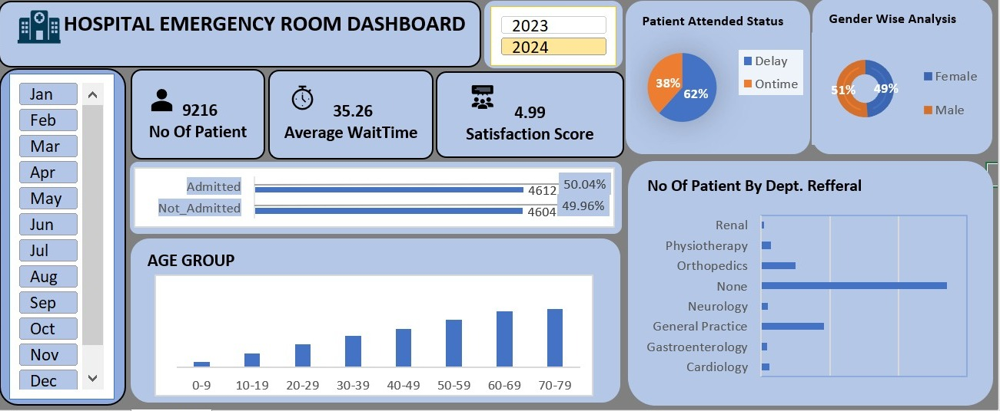

This Excel-based Hospital Emergency Room Dashboard provides real-time insights into emergency room performance and patient demographics. It is designed to support hospital administration with quick, data-driven decision-making. The dashboard uses interactive elements such as slicers and data visualizations for better accessibility.

Key Features:

📊 Visual breakdown of total patients (Jan–Dec)

🕐 Real-time tracking of average wait time (35.26 minutes)

⭐ Patient satisfaction analysis (Score: 4.99)

🔁 Admission vs. Non-admission tracking

🎯 Patient Age Group Distribution (0–79)

🔍 Gender-wise Analysis

🩺 Department-wise Referrals

📅 Year-wise toggle: 2023 & 2024

🧩 Built-in slicers for month-wise insights

Tools Used:
Microsoft Excel (Dashboards, Pivot Tables, Slicers, Charts, Formulas)
